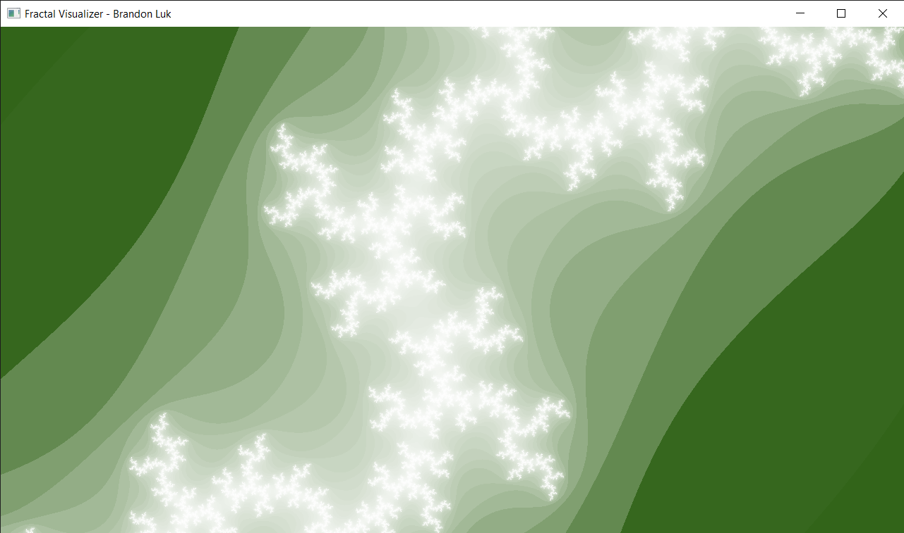

# Fractal Visualizer
This program visualizes various fractal sets in a colored plot.

  
# Dependencies
GLFW for windowing  
An AVX2 capable CPU

Tested with a Ryzen 7 3700x, on Windows 10, compiled with MSVC

# Current features
Fractals:  
  Mandelbrot (w/wo AVX2)
  Julia
  
 Color schemes:
  Simple sine based color palette
  Histogram
  
# Controls
  W, A, S, D - Pan up, left, down, and right
  Q, E - Zoom out and in, respectively
  R - Reset fractal parameters(zoom, pan) to default 
  F - Switch between fractal sets
  I - Switch between standard and AVX instruction sets on applicable fractals
  C - Switch between color sets
  -, = - Decrease and increase fractal iteration limits, respectively
  
  Mouse scrollwheen can be used to zoom in/out while following the mouse cursor

 # Parallelization
 Fractals are, of course, embarrassingly parallel. To take advantage of this, this program utilizes a persistent thread pool that actively pops jobs from a queue and executes them. In conjunction, the AVX2 instruction set is used to take advantage of the CPU's 256-bit SIMD registers and calculate 4 fractal values at once.
